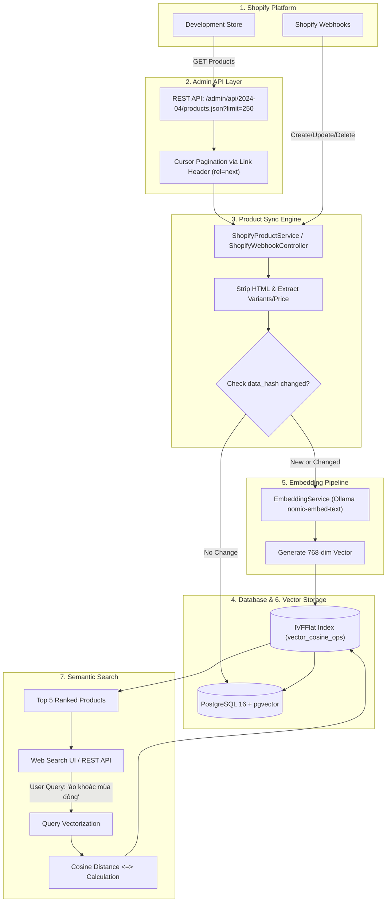

# Shopify Product Synchronization & Vector Search (Semantic Search)

> Dự án **Shopify App** hoàn chỉnh được xây dựng trên nền tảng **Laravel 12**, **PostgreSQL (pgvector)** và mô hình AI Embeddings cục bộ **Ollama (`nomic-embed-text`)**, đáp ứng đầy đủ yêu cầu bài test tuyển dụng Shopify App Developer của Công ty CP CNTT Minh Ngọc.

---

## 📑 Mục lục
1. [Installation (Cách cài đặt project)](#1-installation-cách-cài-đặt-project)
2. [Configuration (Các biến môi trường cần thiết)](#2-configuration-các-biến-môi-trường-cần-thiết)
3. [Shopify Setup (Cách cấu hình Shopify App)](#3-shopify-setup-cách-cấu-hình-shopify-app)
4. [Database (Cơ sở dữ liệu sử dụng & Schema)](#4-database-cơ-sở-dữ-liệu-sử-dụng--schema)
5. [Embedding (Model & Provider sử dụng)](#5-embedding-model--provider-sử-dụng)
6. [Vector Search (Giải thích cách lưu và tìm kiếm vector)](#6-vector-search-giải-thích-cách-lưu-và-tìm-kiếm-vector)
7. [Architecture (Mô tả luồng dữ liệu Shopify → Semantic Search)](#7-architecture-mô-tả-luồng-dữ-liệu-shopify--semantic-search)
8. [Shopify Webhooks (Đồng bộ thời gian thực)](#8-shopify-webhooks-đồng-bộ-thời-gian-thực)

---

## 1. Installation (Cách cài đặt project)

Dự án được đóng gói trọn gói và chuẩn hóa qua **Docker Compose** (chạy sẵn PHP 8.3/Laravel 12, PostgreSQL 16 + pgvector, và Ollama AI container).

### Bước 1: Clone repository
```bash
git clone https://github.com/hoangvantuan1105/shopify_test.git
cd shopify_test
```

### Bước 2: Khởi tạo file cấu hình môi trường
```bash
cp .env.example .env
```
*(Xem mục [Configuration](#2-configuration-các-biến-môi-trường-cần-thiết) để điền thông tin Shopify API Key và Secret).*

### Bước 3: Khởi chạy các dịch vụ Docker
```bash
docker compose up -d --build
```
Kiểm tra đảm bảo 3 container đang chạy ổn định:
* `shopify_app`: Laravel application (Port `8000`)
* `shopify_db`: PostgreSQL 16 với extension pgvector (Port `5432`)
* `shopify_ollama`: Ollama server (Port `11434`)

### Bước 4: Chạy Migration cơ sở dữ liệu
```bash
docker compose exec app php artisan migrate
```

### Bước 5: Tải mô hình Embedding `nomic-embed-text` vào Ollama
```bash
docker compose exec ollama ollama pull nomic-embed-text
```

### Bước 6: Truy cập ứng dụng
* Giao diện Quản lý sản phẩm & Sync: `http://localhost:8000/products`
* Giao diện Tìm kiếm ngữ nghĩa: `http://localhost:8000/search`

---

## 2. Configuration (Các biến môi trường cần thiết)

File `.env` cần khai báo đầy đủ các nhóm biến sau:

| Biến môi trường | Giá trị mẫu / Mục đích |
| :--- | :--- |
| `APP_NAME` | `Laravel` |
| `APP_ENV` | `local` |
| `APP_KEY` | Key mã hóa của Laravel (sinh tự động qua `php artisan key:generate`) |
| `APP_URL` | `http://localhost:8000` |
| `DB_CONNECTION` | `pgsql` |
| `DB_HOST` | `db` (Tên container database trong docker-compose) |
| `DB_PORT` | `5432` |
| `DB_DATABASE` | `shopify_vector_search` |
| `DB_USERNAME` | `postgres` |
| `DB_PASSWORD` | `secret` |
| `SHOPIFY_API_KEY` | Client ID lấy từ Shopify Partners Dashboard |
| `SHOPIFY_API_SECRET`| Client Secret lấy từ Shopify Partners Dashboard |
| `SHOPIFY_APP_URL` | Domain công khai (URL Ngrok trỏ về port 8000, ví dụ: `https://your-tunnel.ngrok-free.dev`) |
| `SHOPIFY_SCOPES` | `read_products` (Tuân thủ nguyên tắc Least-Privilege) |
| `SHOPIFY_API_VERSION`| `2024-04` |
| `EMBEDDING_PROVIDER`| `ollama` (Mặc định chạy local qua Ollama) |
| `OLLAMA_BASE_URL` | `http://ollama:11434` |
| `OLLAMA_EMBED_MODEL`| `nomic-embed-text` |

---

## 3. Shopify Setup (Cách cấu hình Shopify App)

1. **Tạo App trên Shopify Partners:**
   * Đăng nhập [Shopify Partners Dashboard](https://partners.shopify.com/) $\rightarrow$ **Apps** $\rightarrow$ **Create App**.
   * Chọn **Create app manually**, đặt tên App (ví dụ: `Vector Search App`).

2. **Cấu hình URLs trong App Setup:**
   * **App URL**: Điền đường dẫn Ngrok công khai (ví dụ: `https://your-tunnel.ngrok-free.dev`).
   * **Allowed redirection URL(s)**:
     ```
     https://your-tunnel.ngrok-free.dev/auth/callback
     ```

3. **Cập nhật thông tin xác thực vào `.env`:**
   * Sao chép **Client ID** vào `SHOPIFY_API_KEY`.
   * Sao chép **Client Secret** vào `SHOPIFY_API_SECRET`.
   * Cập nhật `SHOPIFY_APP_URL=https://your-tunnel.ngrok-free.dev`.

4. **Cài đặt App vào Development Store:**
   * Truy cập từ trình duyệt theo định dạng:
     ```
     http://localhost:8000/auth?shop=your-development-store.myshopify.com
     ```
   * Shopify sẽ chuyển hướng đến màn hình xác nhận phân quyền `read_products`.
   * Merchant nhấn **Install app**, hệ thống tự động lưu `access_token` và chuyển về trang quản lý `/products`.

5. **Đăng ký Webhook tự động với Shopify:**
   ```bash
   docker compose exec app php artisan shopify:register-webhooks
   ```

---

## 4. Database (Cơ sở dữ liệu sử dụng & Schema)

### Hệ quản trị cơ sở dữ liệu:
* **PostgreSQL 16** tích hợp extension **`pgvector`** (`pgvector/pgvector:pg16`).

### Bảng `products`:
Lưu trữ thông tin chi tiết của sản phẩm đồng bộ từ Shopify và vector embedding 768 chiều:

```sql
CREATE TABLE products (
    id BIGSERIAL PRIMARY KEY,
    shopify_product_id BIGINT UNIQUE NOT NULL,
    title VARCHAR(255) NOT NULL,
    description TEXT,
    vendor VARCHAR(255),
    product_type VARCHAR(255),
    tags TEXT,
    variants JSONB,
    price DECIMAL(10, 2),
    image_url TEXT,
    shopify_created_at TIMESTAMPTZ,
    shopify_updated_at TIMESTAMPTZ,
    synced_at TIMESTAMPTZ,
    deleted_at TIMESTAMPTZ,
    data_hash VARCHAR(64),
    embedding vector(768),
    created_at TIMESTAMP,
    updated_at TIMESTAMP
);
```

### Chỉ mục tăng tốc tìm kiếm Vector (Vector Index):
Sử dụng chỉ mục **IVFFlat** với hàm khoảng cách Cosine Distance (`vector_cosine_ops`) để tìm kiếm láng giềng gần đúng (Approximate Nearest Neighbors - ANN) cực nhanh:
```sql
CREATE INDEX products_embedding_idx 
ON products USING ivfflat (embedding vector_cosine_ops) WITH (lists = 100);
```

---

## 5. Embedding (Model & Provider sử dụng)

* **Provider**: **Ollama** (Self-hosted chạy cục bộ trong Docker container `shopify_ollama`).
  * *Lợi ích*: Không phát sinh chi phí API token (miễn phí 100%), không giới hạn rate-limit, bảo mật dữ liệu sản phẩm trong mạng nội bộ.
* **Model**: **`nomic-embed-text`** (768 chiều).
  * *Đặc điểm*: Mô hình embedding mã nguồn mở hàng đầu cho tác vụ Information Retrieval / Semantic Search, dung lượng nhỏ (~274MB), tốc độ suy luận nhanh (10-25ms/sản phẩm).
* **Quy tắc tạo chuỗi đại diện ngữ nghĩa (Context String):**
  ```php
  $representationText = "Title: {$title}. Description: {$description}. Vendor: {$vendor}. Category: {$productType}. Tags: {$tags}. Price: ${$price}";
  ```
* **Cơ chế tối ưu hóa `data_hash` (Mục 6 đề bài):**
  * Mỗi sản phẩm được gán mã băm `data_hash = md5($representationText)`.
  * Khi đồng bộ hoặc nhận webhook cập nhật, nếu `data_hash` không thay đổi so với giá trị cũ trong DB $\rightarrow$ **Hệ thống bỏ qua bước gọi Ollama**, tránh lãng phí tài nguyên CPU/GPU.

---

## 6. Vector Search (Giải thích cách lưu và tìm kiếm vector)

### 1. Cách lưu vector:
* Vector được sinh ra từ mô hình `nomic-embed-text` là mảng 768 số thực (`array<float>`).
* Được lưu trực tiếp vào cột `embedding` kiểu `vector(768)` trong bảng `products` của PostgreSQL nhờ extension `pgvector`.
* Eloquent Model `Product` sử dụng cast `Pgvector\Laravel\Vector` để serialize/deserialize mảng vector tự động.

### 2. Cách tìm kiếm vector (Semantic Search Pipeline):
1. **Vector hóa truy vấn:** Khi người dùng nhập câu tìm kiếm ngữ nghĩa (ví dụ: *"áo nam màu đen dưới 500k"* hoặc *"dụng cụ trượt tuyết mùa đông"*), hệ thống gửi chuỗi này tới Ollama API để tạo một `query_vector` 768 chiều.
2. **Tính khoảng cách Cosine Distance trong SQL:**
   Thực thi câu lệnh SQL với toán tử khoảng cách cosine `<=>`:
   ```sql
   SELECT id, shopify_product_id, title, price, image_url, vendor,
          (1 - (embedding <=> :query_vector::vector)) AS similarity
   FROM products
   WHERE deleted_at IS NULL
     AND embedding IS NOT NULL
   ORDER BY embedding <=> :query_vector::vector ASC
   LIMIT 5;
   ```
3. **Quy đổi ra Độ tương đồng % (Similarity Score):**
   $$\text{Similarity Score} = (1 - \text{Cosine Distance}) \times 100\%$$
4. **Kết quả hiển thị:**
   * Trả về **Top 5 sản phẩm tương đồng nhất**, bao gồm: Ảnh sản phẩm, Tên sản phẩm, Giá, Nhà sản xuất, Điểm tương đồng % và Thời gian truy vấn (Query time tính bằng mili-giây).
   * Hỗ trợ giao diện Web tại `/search` và JSON REST API (`Accept: application/json`).

---

## 7. Architecture (Mô tả luồng dữ liệu Shopify → Semantic Search)

### Chuỗi luồng dữ liệu:
**`Shopify` $\longrightarrow$ `Admin API` $\longrightarrow$ `Product Sync` $\longrightarrow$ `Database` $\longrightarrow$ `Embedding` $\longrightarrow$ `Vector Storage` $\longrightarrow$ `Semantic Search`**

### Sơ đồ luồng dữ liệu chi tiết (End-to-End Diagram):



### Mô tả ngắn từng bước trong luồng:
1. **Shopify:** Cửa hàng Shopify lưu trữ danh mục sản phẩm của Merchant.
2. **Admin API:** App gửi request xác thực qua `X-Shopify-Access-Token` tới `/admin/api/2024-04/products.json`. Xử lý phân trang nhiều trang liên tiếp qua HTTP `Link` header (`rel="next"`).
3. **Product Sync:** Bóc tách tiêu đề, làm sạch thẻ HTML trong mô tả, lấy giá biến thể đầu tiên, ảnh đại diện và tính mã băm `data_hash`. Đánh dấu `deleted_at = now()` cho các sản phẩm không còn tồn tại trên Shopify.
4. **Database:** Lưu bản ghi sản phẩm vào bảng `products` trong PostgreSQL.
5. **Embedding:** Ghép chuỗi văn bản đại diện và gửi tới container Ollama mô hình `nomic-embed-text`.
6. **Vector Storage:** Lưu vector 768 chiều vào cột `embedding` và đánh chỉ mục `ivfflat`.
7. **Semantic Search:** Khi người dùng tìm kiếm, câu truy vấn được chuyển thành vector $\rightarrow$ truy vấn khoảng cách cosine trong PostgreSQL $\rightarrow$ xếp hạng và trả về Top 5 kết quả sát nghĩa nhất.

---

## 8. Shopify Webhooks (Đồng bộ thời gian thực)

Hệ thống tiếp nhận thay đổi sản phẩm từ Shopify theo thời gian thực:

| Webhook Event | Endpoint | Xử lý |
| :--- | :--- | :--- |
| `products/create` | `POST /webhooks/products/create` | Tạo mới sản phẩm trong DB, tự động gọi Ollama sinh vector 768 chiều. |
| `products/update` | `POST /webhooks/products/update` | Cập nhật thông tin. Nếu `data_hash` không đổi (ví dụ chỉ đổi tồn kho), bỏ qua sinh vector. Nếu đổi nội dung, tự động tạo lại vector. |
| `products/delete` | `POST /webhooks/products/delete` | Tự động đánh dấu soft-delete `deleted_at = now()` và xóa vector (`embedding = null`). |

* **Bảo mật HMAC:** Middleware `VerifyShopifyWebhook` tính toán SHA256 HMAC từ raw request body đối soát với `X-Shopify-Hmac-Sha256`.
* **Tính lũy đẳng (Idempotency):** Đọc header `X-Shopify-Webhook-Id` và cache 24h, tự động bỏ qua nếu Shopify gửi trùng lặp webhook.

---

