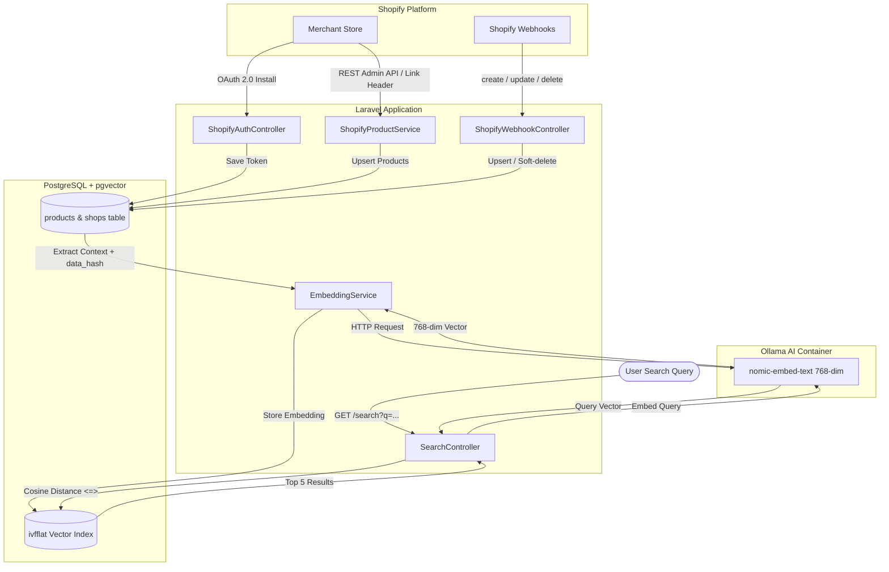

# Shopify Product Synchronization & Vector Search (Semantic Search)

> Dự án **Shopify App** hoàn chỉnh được xây dựng trên nền tảng **Laravel 12**, **PostgreSQL (pgvector)** và mô hình AI Embeddings cục bộ **Ollama (`nomic-embed-text`)**, đáp ứng đầy đủ yêu cầu bài test tuyển dụng Shopify App Developer của Công ty CP CNTT Minh Ngọc.

---

## 📑 Mục lục
1. [Kiến trúc hệ thống (Architecture)](#1-kiến-trúc-hệ-thống-architecture)
2. [Cài đặt dự án (Installation)](#2-cài-đặt-dự-án-installation)
3. [Cấu hình môi trường (Configuration)](#3-cấu-hình-môi-trường-configuration)
4. [Cấu hình Shopify App (Shopify Setup)](#4-cấu-hình-shopify-app-shopify-setup)
5. [Cơ sở dữ liệu & Lưu trữ Vector (Database & Vector Storage)](#5-cơ-sở-dữ-liệu--lưu-trữ-vector-database--vector-storage)
6. [Mô hình Embedding (Embedding Model & Provider)](#6-mô-hình-embedding-embedding-model--provider)
7. [Cơ chế Tìm kiếm Ngữ nghĩa (Vector Search / Semantic Search)](#7-cơ-chế-tìm-kiếm-ngữ-nghĩa-vector-search--semantic-search)
8. [Đồng bộ Webhook thời gian thực (Shopify Webhooks)](#8-đồng-bộ-webhook-thời-gian-thực-shopify-webhooks)

---

## 1. Kiến trúc hệ thống (Architecture)

### Sơ đồ luồng dữ liệu (End-to-End Pipeline)



### Chi tiết các bước trong luồng:
1. **Shopify OAuth 2.0**: Merchant cài đặt App vào Development Store, xác thực chữ ký HMAC và mã nonce `state` chống CSRF. Hệ thống cấp `access_token` và lưu vào bảng `shops`.
2. **Admin API & Product Sync**:
   * App gọi Shopify REST Admin API (`/admin/api/2024-04/products.json?limit=250`).
   * Sử dụng **Cursor-based pagination qua HTTP `Link` header** (`rel="next"`) để lấy toàn bộ dữ liệu nhiều trang, không giới hạn số lượng.
   * Xử lý sản phẩm bị xóa: các sản phẩm không còn tồn tại trên Shopify sẽ được đánh dấu `deleted_at = now()` và loại bỏ vector (`embedding = null`).
3. **Data Representation & Hash Optimization**:
   * Dữ liệu đại diện được chuẩn hóa: `Title | Description | Vendor | Product Type | Tags | Price`.
   * Tính mã băm `data_hash = md5(...)`. Chỉ sinh lại vector khi `data_hash` thay đổi hoặc vector chưa có, giúp tối ưu chi phí và tốc độ.
4. **Embedding Pipeline**:
   * Gọi mô hình cục bộ `nomic-embed-text` qua Ollama API (`http://ollama:11434/api/embeddings`) để chuyển văn bản thành vector 768 chiều.
5. **Vector Storage**:
   * Lưu trữ trực tiếp trong PostgreSQL dưới kiểu dữ liệu `vector(768)`.
   * Tối ưu truy vấn bằng chỉ mục `ivfflat (embedding vector_cosine_ops) WITH (lists = 100)`.
6. **Semantic Search**:
   * Người dùng nhập từ khóa ngữ nghĩa (ví dụ: *"áo nam màu đen dưới 500k"*, *"dụng cụ trượt tuyết mùa đông"*).
   * Chuyển truy vấn thành vector 768 chiều.
   * Tính toán khoảng cách Cosine Distance (`<=>`) trực tiếp trong câu lệnh SQL:
     $$\text{Similarity Score} = (1 - \text{Cosine Distance}) \times 100\%$$
   * Trả về **Top 5 sản phẩm tương đồng nhất**, kèm ảnh, giá, tags và thời gian truy vấn (Query time ms).

---

## 2. Cài đặt dự án (Installation)

Dự án được đóng gói trọn vẹn thông qua **Docker Compose** (bao gồm PHP 8.3/Laravel 12, PostgreSQL 16 + pgvector, và Ollama).

### Bước 1: Clone repository
```bash
git clone https://github.com/hoangvantuan1105/shopify_test.git
cd shopify_test
```

### Bước 2: Tạo file cấu hình môi trường
```bash
cp .env.example .env
```
*(Chỉnh sửa các biến `SHOPIFY_API_KEY`, `SHOPIFY_API_SECRET`, `SHOPIFY_APP_URL` trong file `.env` theo thông tin App của bạn).*

### Bước 3: Khởi chạy Docker Containers
```bash
docker compose up -d --build
```
Kiểm tra 3 container đang chạy ổn định:
* `shopify_app`: Laravel application (Port `8000`)
* `shopify_db`: PostgreSQL với pgvector (Port `5432`)
* `shopify_ollama`: Ollama server (Port `11434`)

### Bước 4: Chạy Migration cơ sở dữ liệu
```bash
docker compose exec app php artisan migrate
```

### Bước 5: Tải mô hình Embedding vào Ollama
```bash
docker compose exec ollama ollama pull nomic-embed-text
```

### Bước 6: Truy cập ứng dụng
* Giao diện Quản lý sản phẩm & Sync: `http://localhost:8000/products`
* Giao diện Semantic Search: `http://localhost:8000/search`

---

## 3. Cấu hình môi trường (Configuration)

Các biến môi trường bắt buộc cần khai báo trong file `.env`:

| Biến môi trường | Giá trị mẫu / Mô tả |
| :--- | :--- |
| `APP_URL` | `http://localhost:8000` |
| `DB_CONNECTION` | `pgsql` |
| `DB_HOST` | `db` (tên service trong Docker) |
| `DB_PORT` | `5432` |
| `DB_DATABASE` | `shopify_vector_search` |
| `DB_USERNAME` | `postgres` |
| `DB_PASSWORD` | `secret` |
| `SHOPIFY_API_KEY` | API Key lấy từ Shopify Partners Dashboard |
| `SHOPIFY_API_SECRET` | API Secret Key từ Shopify Partners Dashboard |
| `SHOPIFY_APP_URL` | Domain public (Ngrok URL, ví dụ: `https://your-ngrok.ngrok-free.dev`) |
| `SHOPIFY_SCOPES` | `read_products` (Least-Privilege) |
| `SHOPIFY_API_VERSION` | `2024-04` |
| `EMBEDDING_PROVIDER` | `ollama` |
| `OLLAMA_BASE_URL` | `http://ollama:11434` |
| `OLLAMA_EMBED_MODEL` | `nomic-embed-text` |

---

## 4. Cấu hình Shopify App (Shopify Setup)

1. Đăng nhập vào [Shopify Partners Dashboard](https://partners.shopify.com/) và vào mục **Apps** > **Create App**.
2. Chọn **Create app manually**, đặt tên cho ứng dụng (ví dụ: `Product Vector Search`).
3. Trong mục **App setup**:
   * **App URL**: Điền URL Ngrok trỏ về port 8000 (ví dụ: `https://your-domain.ngrok-free.dev`).
   * **Allowed redirection URL(s)**:
     ```
     https://your-domain.ngrok-free.dev/auth/callback
     ```
4. Lưu cấu hình và sao chép **Client ID** và **Client Secret** vào file `.env` (`SHOPIFY_API_KEY` và `SHOPIFY_API_SECRET`).
5. **Cài đặt vào Development Store**:
   Truy cập trình duyệt theo định dạng:
   ```
   http://localhost:8000/auth?shop=your-development-store.myshopify.com
   ```
   Hệ thống sẽ chuyển hướng sang trang OAuth của Shopify để Merchant xác nhận cấp quyền `read_products`. Sau khi duyệt, Merchant được chuyển về màn hình quản lý `/products`.

---

## 5. Cơ sở dữ liệu & Lưu trữ Vector (Database & Vector Storage)

### Cơ sở dữ liệu được sử dụng:
* **PostgreSQL 16** kết hợp extension **`pgvector`** (chạy từ Docker image chính thức `pgvector/pgvector:pg16`).

### Cấu trúc bảng `products`:
```sql
CREATE TABLE products (
    id BIGSERIAL PRIMARY KEY,
    shopify_product_id BIGINT UNIQUE NOT NULL,
    title VARCHAR(255) NOT NULL,
    description TEXT,
    vendor VARCHAR(255),
    product_type VARCHAR(255),
    tags TEXT,
    variants JSONB,
    price DECIMAL(10, 2),
    image_url TEXT,
    shopify_created_at TIMESTAMPTZ,
    shopify_updated_at TIMESTAMPTZ,
    synced_at TIMESTAMPTZ,
    deleted_at TIMESTAMPTZ,
    data_hash VARCHAR(64),
    embedding vector(768),
    created_at TIMESTAMP,
    updated_at TIMESTAMP
);
```

### Cơ chế Indexing Vector:
Để tăng tốc độ tìm kiếm vector gần đúng (Approximate Nearest Neighbors - ANN) trên tập dữ liệu lớn, bảng `products` được đánh chỉ mục **IVFFlat** sử dụng phép đo góc Cosine:
```sql
CREATE INDEX products_embedding_idx 
ON products USING ivfflat (embedding vector_cosine_ops) WITH (lists = 100);
```

---

## 6. Mô hình Embedding (Embedding Model & Provider)

* **Provider**: **Ollama** (Self-hosted chạy độc lập trong Docker container `shopify_ollama`).
  * *Lý do lựa chọn*: Hoàn toàn miễn phí, bảo mật nội bộ dữ liệu sản phẩm, không lo bị nghẽn rate-limit hoặc hết quota như các dịch vụ thương mại ngoài.
* **Mô hình**: **`nomic-embed-text`** (768 chiều).
  * *Ưu điểm*: Được huấn luyện chuyên sâu cho tác vụ Information Retrieval (Semantic Search), hiệu năng vượt trội, kích thước nhẹ (~274MB) và thời gian sinh vector chỉ từ 10-30ms/sản phẩm.
* **Chuỗi văn bản đại diện ngữ nghĩa (Context Construction)**:
  ```
  {Title} | {Description} | Nhà sản xuất: {Vendor} | Thể loại: {Product Type} | Phân loại: {Tags} | Giá: {Price}$
  ```
* **Artisan Command hỗ trợ:**
  ```bash
  # Vector hóa các sản phẩm mới hoặc có dữ liệu thay đổi
  docker compose exec app php artisan products:embed

  # Buộc tạo lại vector cho toàn bộ sản phẩm
  docker compose exec app php artisan products:embed --force
  ```

---

## 7. Cơ chế Tìm kiếm Ngữ nghĩa (Vector Search / Semantic Search)

### Thuật toán tìm kiếm:
Khi nhận được câu truy vấn từ Merchant:
1. Hệ thống chuyển đổi câu truy vấn thành vector 768 chiều thông qua Ollama.
2. Thực thi truy vấn SQL với toán tử khoảng cách cosine `<=>`:
   ```sql
   SELECT id, shopify_product_id, title, price, image_url, vendor,
          (1 - (embedding <=> :query_vector::vector)) AS similarity
   FROM products
   WHERE deleted_at IS NULL
     AND embedding IS NOT NULL
   ORDER BY embedding <=> :query_vector::vector ASC
   LIMIT 5;
   ```
3. Kết quả trả về gồm **Top 5 sản phẩm có độ tương đồng ngữ nghĩa cao nhất** kèm thời gian xử lý (Query Time tính bằng mili-giây).

### Giao diện và API:
* **Giao diện Web**: Truy cập `http://localhost:8000/search`
* **JSON REST API**:
  ```bash
  curl -H "Accept: application/json" "http://localhost:8000/search?q=snowboard+winter"
  ```

---

## 8. Đồng bộ Webhook thời gian thực (Shopify Webhooks)

Ứng dụng cung cấp các endpoint webhook để tiếp nhận thay đổi sản phẩm theo thời gian thực từ Shopify:

| Event | Endpoint | Xử lý |
| :--- | :--- | :--- |
| `products/create` | `POST /webhooks/products/create` | Lưu sản phẩm vào DB, tự động sinh vector embedding và lưu vào `pgvector`. |
| `products/update` | `POST /webhooks/products/update` | Cập nhật dữ liệu, kiểm tra `data_hash` để chỉ tạo lại vector khi nội dung ngữ nghĩa thay đổi. |
| `products/delete` | `POST /webhooks/products/delete` | Đánh dấu soft-delete `deleted_at = now()` và loại bỏ vector (`embedding = null`). |

### Tính năng bảo mật & tối ưu Webhook:
* **Xác thực chữ ký HMAC:** Middleware `VerifyShopifyWebhook` bóc tách header `X-Shopify-Hmac-Sha256`, tính toán lại chữ ký HMAC-SHA256 từ raw payload và dùng `hash_equals` đối soát nghiêm ngặt.
* **Xử lý Idempotent (Chống trùng lặp):** Đọc header `X-Shopify-Webhook-Id` và lưu cache 24h. Nếu Shopify gửi lại webhook trùng lặp, hệ thống tự động nhận diện và trả về `200 OK` ngay lập tức mà không thực thi lại logic.

---


